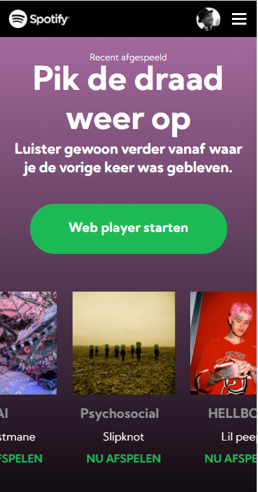

# Procesverslag
**Auteur:** Tim de Roller

## Bronnenlijst
1. https://www.w3schools.com/
2. de lessen
3. https://css-tricks.com/
4. http://sinds1971.nl/
5. https://www.pagecloud.com/blog/how-to-add-custom-fonts-to-any-website
6. https://stackoverflow.com/questions/22928819/override-the-webkit-search-cancel-button

## Eindgesprek (week 7/8)

Ik heb lekker gewerkt aan de site. In het begin was het lastig om alles goed op ze plek te krijgen zoals ze op de Spotify site hebben maar uiteindelijk is dit wel goed gelukt.
Ook heb ik wat domme dingen toegevoegd aan de 2e pagina omdat ik wat ideeën had en benieuwd was of ik het kon maken. Je kan deze dingen testen door deze dingen te typen:
dvd, star wars, tiny, do a barrel roll.

**Screenshot(s):**

## Voortgang 3 (week 6)

Ik ben bezig met pagina 2. Hier heb je een zoekbalk en heb hier wat stomme kleine ideeën voor dus ik hoop dat het me lukt om die te maken. Ik heb ook de code op de eerste pagina nu allemaal verbeterd.

## Voortgang 2 (week 5)

Ik heb de eerste pagina bijna af, ik moet de navigatie even laten werken en dan kan ik beginnen aan pagina 2. Ik heb wel nog wat code te verbeteren omdat ik het niet helemaal heb gedaan zoals het hoort.

## Voortgang 1 (week 3)

Ik heb tot nu toe de header en de eerste section bijna af. Ik heb een probleem met horizontaal scrollen, dus daar moet ik even verder naar kijken. Ik wil het liefste het zelf eerste proberen voordat ik het ga vragen in de les dus dat ga ik eerst doen. Als ik weet hoe het horizontaal scrollen werkt kan ik de andere toevoegen en dan is de eerste section ook af.

### Stand van zaken

16/9/2020 Toen ik begon was het weer even in komen, heb in de vakantie niet veel geprogrammeerd dus het was weer even wennen. Maar door de lessen was het wel weer beetje bijgekomen.
Het is soms wel even kijken om het goed responsive te krijgen, maar tot nu toe is het goed gelukt.

28/9/2020 Ik zat eventjes vast op een probleem met horizontaal scrollen maar dit probleem is gelukkig opgelost. Heb ook een kleine easter egg op de site gezet omdat ik daar even zin in had. Ik moet nu de albums nog even goed invullen en alles een beetje goed namaken en dan kan ik beginnen aan de 2e section.

5/10/2020

**Screenshot(s):**

### Agenda voor meeting

Eindgesprek

### Verslag van meeting

We zijn begonnen met de meeting en hebben het gehad over de vragen. We hadden niet veel vragen dus de meeting ging snel.

## Intake (week 1)

**Je startniveau:** Rood

**Je focus:** Surface

**Je opdracht:** Ik kies voor het beter maken van de surface van de Spotify website

**Screenshot(s):**

**Breakdown-schets(en):**

